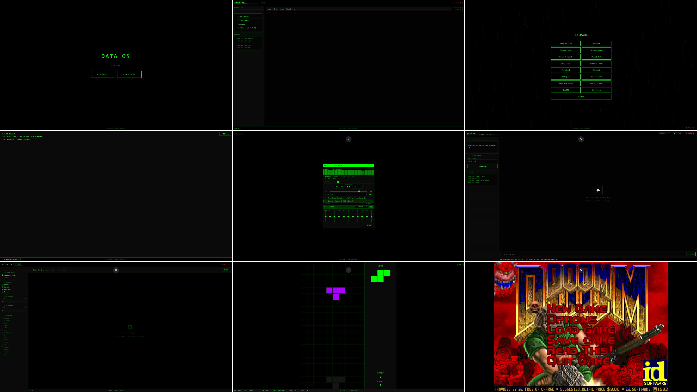

<div align="center">

# Data OS


**v11.0.0** · A browser-based hacker OS with a full terminal, apps, and retro games.





</div>

---

<div align="center">

## What is Data OS?

Data OS is a **single HTML file** that turns your browser into a retro terminal environment. It runs entirely client-side — no server, no install, no dependencies. Just open the file (or visit the hosted page) and you're dropped into a green-on-black MS-DOS-inspired desktop with a working terminal, a suite of built-in apps, and a collection of retro games.

Originally built to live as a Base64 data URI in a browser's address bar (to work around school `file://` restrictions), it evolved into a full featured web OS.

</div>

---

## Features

<div align="center">

### MS-DOS Terminal

A fully emulated command-line environment with a real virtual filesystem.

</div>

```
C:\Users\anonymous> dir
C:\Users\anonymous> cd Games
C:\Users\anonymous\Games> tetris
C:\Users\anonymous\Games> cd ..\Apps
C:\Users\anonymous\Apps> calc.exe
```

<div align="center">

**Supported commands:**

| Command | Description |
|---|---|
| `dir` | List files in current directory |
| `cd [folder]` | Change directory |
| `md / rd` | Make or remove a folder |
| `del / copy / move / ren` | File operations |
| `type [file]` | Print file contents |
| `cls` | Clear screen |
| `echo`, `ver`, `date`, `time` | Utility commands |
| `whoami`, `hostname`, `systeminfo` | System info |
| `tasklist`, `ipconfig`, `ping` | Network/process info |
| `set` | Show environment variables |
| `help [cmd]` | Get help on any command |
| `ez-mode` | Open the EZ-Mode GUI launcher |

</div>

**Virtual filesystem layout:**
```
C:\
  Users\
    anonymous\
      Desktop\
      Documents\
      Downloads\
      Apps\       ← Small apps (.exe)
      Games\      ← Retro games
  Program Files\
    Google\Chrome\
```

---

<div align="center">

### P2P Messaging — `peer.exe`

Real-time, peer-to-peer encrypted messaging powered by **PeerJS** over WebRTC.

- Each session generates a unique Peer ID
- Share your ID with anyone to establish a direct data channel
- Text-only, no server stores your messages
- Transport: WebRTC Data Channel · Signaling: PeerJS Cloud · ICE: Google STUN

---

### GitHub Browser — `github.exe`

A full GitHub repository explorer using the **GitHub REST API**.

- Browse any public user's repositories
- Navigate folder structures and view file contents with syntax highlighting
- Run JavaScript files directly in-browser via a sandboxed code runner
- Download repos as ZIP archives
- View files on GitHub with a single click

---

### Browser — `browser.exe`

An iframe-based browser with Wikipedia integration.

- Load any URL into a full-page iframe frame
- Type a non-URL query to search **Wikipedia's API** instead
- Info cards with article summaries before committing to a full load

---

### Retro Games — `C:\Users\anonymous\Games\`

Six built-in games, all keyboard controlled, all with restart and ESC-to-exit:

| Game | Controls |
|---|---|
| `pong` | W/S to move · SPACE to start |
| `tetris` | Arrow keys · SPACE to hard drop |
| `minesweeper` | Left-click reveal · Right-click flag |
| `snake` | Arrow keys · SPACE to start |
| `breakout` | Mouse or arrow keys · SPACE to launch |
| `2048` | Arrow keys to slide tiles |

---

### HTML Editor — `htmleditor.exe`

A live HTML editor with split-pane preview.

- Write HTML and see it rendered in real time
- Full syntax editing in a monospace terminal-style textarea
- Useful for quick prototypes without leaving the OS

---

### Pixel Art Editor — `pixelart.exe`

A grid-based pixel art canvas.

- Adjustable canvas size
- Color picker and palette
- Draw pixel by pixel with click-and-drag
- Export your art

---

### Paint — `paint.exe`

A freehand drawing canvas.

- Brush with adjustable size and color
- Eraser tool
- Clear canvas

---

### Music Player — `music.exe`

A styled audio player (Music Player v1.0).

- Load and play audio tracks
- Playback controls with terminal aesthetic UI
- Volume and seek controls

---

### Calculator — `calc.exe`

A standard calculator with a hacker terminal skin.

---

### Task Manager — `sysusage.exe`

A live CPU and system usage monitor.

- Real-time overall CPU load graph
- Per-core load bars
- System stat boxes (frequency, threads, etc.)
- Stress test mode to max out your cores

---

### Inspect / Dev Tools — (built-in)

A lightweight DOM inspector and system diagnostics panel built into the OS.

---

### Other Utilities

| App | Description |
|---|---|
| `base64.exe` | Encode/decode Base64 strings |
| `ascii.exe` | Convert images to ASCII art |
| `hacker.exe` | Hacker Typer — look busy |

---

## Getting Started

1. **Download** `data-os.html`
2. **Open** it in any modern browser (Chrome, Edge, Firefox)
3. You're in — the terminal boots automatically

Or boot directly into the **EZ-Mode** launcher by typing `ez-mode` in the terminal for a graphical app grid.

> No server required. No install. No dependencies. 100% client-side.

---

## Architecture

Data OS is a **single self-contained HTML file**. Everything — styles, logic, all app code, and the virtual filesystem — lives inside one file.

</div>

```
data-os.html
├── <style>          Global CSS + per-app styles (green-on-black theme)
├── Terminal engine  MS-DOS command parser + virtual filesystem
├── App system       Dynamic app loader / overlay manager
├── Apps             calc, editor, browser, paint, pixelart, music,
│                    peer, github, sysusage, ascii, base64, hacker
├── Games            pong, tetris, snake, minesweeper, breakout, 2048
└── EZ-Mode          GUI launcher overlay
```

<div align="center">

**Key design constraints:**
- Zero external dependencies (PeerJS is loaded on-demand for P2P only)
- Originally designed to fit in a browser address bar as a Base64 data URI
- All state is in-memory; refreshing resets the OS

---

## Tech Stack

| Layer | Tech |
|---|---|
| Runtime | Vanilla JavaScript (no frameworks) |
| Styling | Pure CSS, monospace green-on-black |
| P2P Messaging | PeerJS + WebRTC |
| GitHub integration | GitHub REST API |
| Wikipedia integration | Wikipedia API |
| Games | HTML5 Canvas |
| Filesystem | In-memory JS object tree |

---

## Credits

Jon Stearns — xXJ0NXx


</div>
